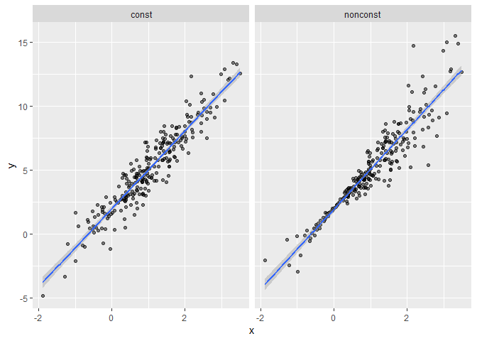
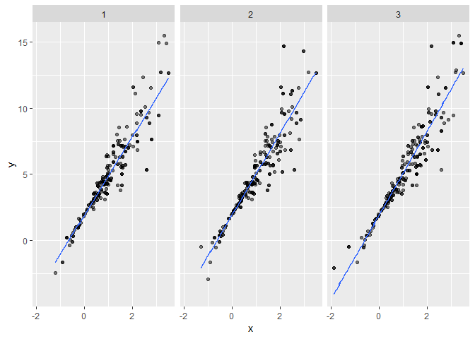
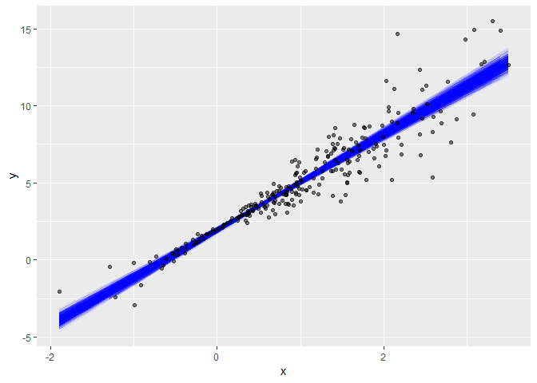

1115 bootstrapping
================
Boya Guo
2018年11月15日

``` r
n_samp = 250

sim_df_const = 
  tibble(
    x = rnorm(n_samp, 1, 1),
    error = rnorm(n_samp, 0, 1),
    y = 2 + 3 * x + error
  )

sim_df_nonconst = sim_df_const %>% 
  mutate(
  error = error * .75 * x,
  y = 2 + 3 * x + error
)
```

``` r
sim_df = 
  bind_rows(const = sim_df_const, nonconst = sim_df_nonconst, .id = "data_source") 

sim_df %>% 
  ggplot(aes(x = x, y = y)) + 
  geom_point(alpha = .5) +
  stat_smooth(method = "lm") +
  facet_grid(~data_source) 
```



``` r
lm(y ~ x, data = sim_df_const) %>% 
  broom::tidy() %>% 
  knitr::kable(digits = 3)
```

| term        |  estimate|  std.error|  statistic|  p.value|
|:------------|---------:|----------:|----------:|--------:|
| (Intercept) |     1.977|      0.098|     20.157|        0|
| x           |     3.045|      0.070|     43.537|        0|

``` r
lm(y ~ x, data = sim_df_nonconst) %>% 
  broom::tidy() %>% 
  knitr::kable(digits = 3)
```

| term        |  estimate|  std.error|  statistic|  p.value|
|:------------|---------:|----------:|----------:|--------:|
| (Intercept) |     1.934|      0.105|     18.456|        0|
| x           |     3.112|      0.075|     41.661|        0|

Bootsrap sample
---------------

``` r
boot_sample = function(df) {
  sample_frac(df, replace = TRUE)
}
```

``` r
boot_sample(sim_df_nonconst) %>% 
  ggplot(aes(x = x, y = y)) + 
  geom_point(alpha = .5) +
  stat_smooth(method = "lm")
```


``` r
boot_straps = data_frame(
  strap_number = 1:1000,
  strap_sample = rerun(1000, boot_sample(sim_df_nonconst))
)

boot_straps
```

    ## # A tibble: 1,000 x 2
    ##    strap_number strap_sample      
    ##           <int> <list>            
    ##  1            1 <tibble [250 x 3]>
    ##  2            2 <tibble [250 x 3]>
    ##  3            3 <tibble [250 x 3]>
    ##  4            4 <tibble [250 x 3]>
    ##  5            5 <tibble [250 x 3]>
    ##  6            6 <tibble [250 x 3]>
    ##  7            7 <tibble [250 x 3]>
    ##  8            8 <tibble [250 x 3]>
    ##  9            9 <tibble [250 x 3]>
    ## 10           10 <tibble [250 x 3]>
    ## # ... with 990 more rows

``` r
boot_straps %>% 
  filter(strap_number %in% 1:2) %>% 
  mutate(strap_sample = map(strap_sample, ~arrange(.x, x))) %>% 
  pull(strap_sample)
```

    ## [[1]]
    ## # A tibble: 250 x 3
    ##         x   error       y
    ##     <dbl>   <dbl>   <dbl>
    ##  1 -1.21  -0.781  -2.43  
    ##  2 -0.914 -0.908  -1.65  
    ##  3 -0.914 -0.908  -1.65  
    ##  4 -0.733  0.447   0.248 
    ##  5 -0.733  0.447   0.248 
    ##  6 -0.733  0.447   0.248 
    ##  7 -0.733  0.447   0.248 
    ##  8 -0.641 -0.416  -0.338 
    ##  9 -0.606 -0.106   0.0774
    ## 10 -0.536  0.0227  0.413 
    ## # ... with 240 more rows
    ## 
    ## [[2]]
    ## # A tibble: 250 x 3
    ##         x   error      y
    ##     <dbl>   <dbl>  <dbl>
    ##  1 -1.29   1.40   -0.454
    ##  2 -0.989 -1.97   -2.93 
    ##  3 -0.914 -0.908  -1.65 
    ##  4 -0.805  0.292  -0.123
    ##  5 -0.733  0.447   0.248
    ##  6 -0.733  0.447   0.248
    ##  7 -0.733  0.447   0.248
    ##  8 -0.665 -0.544  -0.539
    ##  9 -0.536  0.0227  0.413
    ## 10 -0.536  0.0227  0.413
    ## # ... with 240 more rows

Fit linear regression to boot strap sample

``` r
boot_straps %>% 
  filter(strap_number %in% 1:3) %>% 
  unnest() %>% 
  ggplot(aes(x = x, y = y)) + 
  geom_point(alpha = .5) +
  stat_smooth(method = "lm", se = FALSE) +
  facet_grid(~strap_number) 
```



Do this 1000 times and calculate the sd for those 1000

``` r
bootstrap_results = 
  boot_straps %>% 
  mutate(models = map(strap_sample, ~lm(y ~ x, data = .x) ),
         results = map(models, broom::tidy)) %>% 
  select(-strap_sample, -models) %>% 
  unnest() %>% 
  group_by(term) %>% 
  summarize(boot_se = sd(estimate))

bootstrap_results %>% 
  knitr::kable(digits = 3)
```

| term        |  boot\_se|
|:------------|---------:|
| (Intercept) |     0.077|
| x           |     0.106|

variability of 1000 samples

``` r
boot_straps %>% 
  unnest() %>% 
  ggplot(aes(x = x, y = y)) + 
  geom_line(aes(group = strap_number), stat = "smooth", method = "lm", se = FALSE, alpha = .1, color = "blue") +
  geom_point(data = sim_df_nonconst, alpha = .5)
```



### Bootstrap

``` r
boot_straps = 
  sim_df_nonconst %>% 
  modelr::bootstrap(n = 1000)

boot_straps$strap[[1]]
```

    ## <resample [250 x 3]> 228, 50, 145, 2, 208, 160, 25, 179, 149, 11, ...

``` r
as_data_frame(boot_straps$strap[[1]])
```

    ## # A tibble: 250 x 3
    ##         x    error       y
    ##     <dbl>    <dbl>   <dbl>
    ##  1 -0.606 -0.106    0.0774
    ##  2  1.88  -0.431    7.21  
    ##  3 -0.116  0.00958  1.66  
    ##  4  1.18   0.361    5.91  
    ##  5  1.54  -2.43     4.20  
    ##  6  2.87  -1.50     9.11  
    ##  7  1.62   0.190    7.05  
    ##  8  2.03  -0.975    7.11  
    ##  9 -0.286  0.154    1.29  
    ## 10  2.51   1.79    11.3   
    ## # ... with 240 more rows

``` r
sim_df_nonconst %>% 
  modelr::bootstrap(n = 1000) %>% 
  mutate(models = map(strap, ~lm(y ~ x, data = .x) ),
         results = map(models, broom::tidy)) %>% 
  select(-strap, -models) %>% 
  unnest() %>% 
  group_by(term) %>% 
  summarize(boot_se = sd(estimate))
```

    ## # A tibble: 2 x 2
    ##   term        boot_se
    ##   <chr>         <dbl>
    ## 1 (Intercept)  0.0744
    ## 2 x            0.101

Next bootstrap the constant

``` r
sim_df_const %>% 
  modelr::bootstrap(n = 1000) %>% 
  mutate(models = map(strap, ~lm(y ~ x, data = .x) ),
         results = map(models, broom::tidy)) %>% 
  select(-strap, -models) %>% 
  unnest() %>% 
  group_by(term) %>% 
  summarize(boot_se = sd(estimate))
```

    ## # A tibble: 2 x 2
    ##   term        boot_se
    ##   <chr>         <dbl>
    ## 1 (Intercept)  0.0968
    ## 2 x            0.0674

### Bootstrap is also useful for non-standard parameters

``` r
sim_df = 
  tibble(
    x = rnorm(25, 1, 1),
    error = rnorm(25, 0, 1),
    y = 2 + 3 * x + error
  )
```
