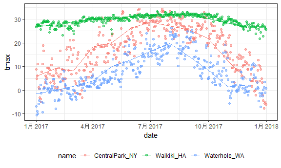

EDA
================
Boya Guo
10/4/2018

``` r
library(tidyverse)
```

    ## -- Attaching packages ------------------ tidyverse 1.2.1 --

    ## √ ggplot2 3.0.0     √ purrr   0.2.5
    ## √ tibble  1.4.2     √ dplyr   0.7.6
    ## √ tidyr   0.8.1     √ stringr 1.3.1
    ## √ readr   1.1.1     √ forcats 0.3.0

    ## -- Conflicts --------------------- tidyverse_conflicts() --
    ## x dplyr::filter() masks stats::filter()
    ## x dplyr::lag()    masks stats::lag()

``` r
knitr::opts_chunk$set(
  fig.width = 6,
  fig.asp = .6,
  out.width = "90%"
)

theme_set(theme_bw() + theme(legend.position = "bottom"))
```

Data import.

We created a new variable called montg, created using lubridate::floor\_date().Lubridate is the package that designs for you to manipulation in date variables.Round down the date to the nearest month.

``` r
library(rnoaa)

weather_df = 
  rnoaa::meteo_pull_monitors(c("USW00094728", "USC00519397", "USS0023B17S"),
                      var = c("PRCP", "TMIN", "TMAX"), 
                      date_min = "2017-01-01",
                      date_max = "2017-12-31") %>%
  mutate(
    name = recode(id, USW00094728 = "CentralPark_NY", 
                      USC00519397 = "Waikiki_HA",
                      USS0023B17S = "Waterhole_WA"),
    tmin = tmin / 10,
    tmax = tmax / 10,
  month = lubridate::floor_date(date, unit = "month")) %>%
  select(name, id, everything())

weather_df
```

    ## # A tibble: 1,095 x 7
    ##    name           id          date        prcp  tmax  tmin month     
    ##    <chr>          <chr>       <date>     <dbl> <dbl> <dbl> <date>    
    ##  1 CentralPark_NY USW00094728 2017-01-01     0   8.9   4.4 2017-01-01
    ##  2 CentralPark_NY USW00094728 2017-01-02    53   5     2.8 2017-01-01
    ##  3 CentralPark_NY USW00094728 2017-01-03   147   6.1   3.9 2017-01-01
    ##  4 CentralPark_NY USW00094728 2017-01-04     0  11.1   1.1 2017-01-01
    ##  5 CentralPark_NY USW00094728 2017-01-05     0   1.1  -2.7 2017-01-01
    ##  6 CentralPark_NY USW00094728 2017-01-06    13   0.6  -3.8 2017-01-01
    ##  7 CentralPark_NY USW00094728 2017-01-07    81  -3.2  -6.6 2017-01-01
    ##  8 CentralPark_NY USW00094728 2017-01-08     0  -3.8  -8.8 2017-01-01
    ##  9 CentralPark_NY USW00094728 2017-01-09     0  -4.9  -9.9 2017-01-01
    ## 10 CentralPark_NY USW00094728 2017-01-10     0   7.8  -6   2017-01-01
    ## # ... with 1,085 more rows

``` r
View(weather_df)
```

Start grouping
--------------

group by (): insert the varaible that you are interested in grouping by.

In the Console pane, you will see: For example: Groups: nam, month \[36\]. The 36 in the bracket is the distinct number of pairs with the grouping order.

Use the ungroup, you could ungroup any groups you have.

``` r
weather_df %>% 
  group_by(name)
```

    ## # A tibble: 1,095 x 7
    ## # Groups:   name [3]
    ##    name           id          date        prcp  tmax  tmin month     
    ##    <chr>          <chr>       <date>     <dbl> <dbl> <dbl> <date>    
    ##  1 CentralPark_NY USW00094728 2017-01-01     0   8.9   4.4 2017-01-01
    ##  2 CentralPark_NY USW00094728 2017-01-02    53   5     2.8 2017-01-01
    ##  3 CentralPark_NY USW00094728 2017-01-03   147   6.1   3.9 2017-01-01
    ##  4 CentralPark_NY USW00094728 2017-01-04     0  11.1   1.1 2017-01-01
    ##  5 CentralPark_NY USW00094728 2017-01-05     0   1.1  -2.7 2017-01-01
    ##  6 CentralPark_NY USW00094728 2017-01-06    13   0.6  -3.8 2017-01-01
    ##  7 CentralPark_NY USW00094728 2017-01-07    81  -3.2  -6.6 2017-01-01
    ##  8 CentralPark_NY USW00094728 2017-01-08     0  -3.8  -8.8 2017-01-01
    ##  9 CentralPark_NY USW00094728 2017-01-09     0  -4.9  -9.9 2017-01-01
    ## 10 CentralPark_NY USW00094728 2017-01-10     0   7.8  -6   2017-01-01
    ## # ... with 1,085 more rows

``` r
weather_df %>% 
  group_by(name,month)
```

    ## # A tibble: 1,095 x 7
    ## # Groups:   name, month [36]
    ##    name           id          date        prcp  tmax  tmin month     
    ##    <chr>          <chr>       <date>     <dbl> <dbl> <dbl> <date>    
    ##  1 CentralPark_NY USW00094728 2017-01-01     0   8.9   4.4 2017-01-01
    ##  2 CentralPark_NY USW00094728 2017-01-02    53   5     2.8 2017-01-01
    ##  3 CentralPark_NY USW00094728 2017-01-03   147   6.1   3.9 2017-01-01
    ##  4 CentralPark_NY USW00094728 2017-01-04     0  11.1   1.1 2017-01-01
    ##  5 CentralPark_NY USW00094728 2017-01-05     0   1.1  -2.7 2017-01-01
    ##  6 CentralPark_NY USW00094728 2017-01-06    13   0.6  -3.8 2017-01-01
    ##  7 CentralPark_NY USW00094728 2017-01-07    81  -3.2  -6.6 2017-01-01
    ##  8 CentralPark_NY USW00094728 2017-01-08     0  -3.8  -8.8 2017-01-01
    ##  9 CentralPark_NY USW00094728 2017-01-09     0  -4.9  -9.9 2017-01-01
    ## 10 CentralPark_NY USW00094728 2017-01-10     0   7.8  -6   2017-01-01
    ## # ... with 1,085 more rows

Summarize: summarize (number=n())： how many elements in each group. Create a summary inside of the group.

``` r
weather_df %>% 
   group_by(name,month) %>%
  summarize(number = n())
```

    ## # A tibble: 36 x 3
    ## # Groups:   name [?]
    ##    name           month      number
    ##    <chr>          <date>      <int>
    ##  1 CentralPark_NY 2017-01-01     31
    ##  2 CentralPark_NY 2017-02-01     28
    ##  3 CentralPark_NY 2017-03-01     31
    ##  4 CentralPark_NY 2017-04-01     30
    ##  5 CentralPark_NY 2017-05-01     31
    ##  6 CentralPark_NY 2017-06-01     30
    ##  7 CentralPark_NY 2017-07-01     31
    ##  8 CentralPark_NY 2017-08-01     31
    ##  9 CentralPark_NY 2017-09-01     30
    ## 10 CentralPark_NY 2017-10-01     31
    ## # ... with 26 more rows

``` r
weather_df %>% 
   group_by(name) %>%
  summarize(number=n())
```

    ## # A tibble: 3 x 2
    ##   name           number
    ##   <chr>           <int>
    ## 1 CentralPark_NY    365
    ## 2 Waikiki_HA        365
    ## 3 Waterhole_WA      365

``` r
weather_df %>% 
   group_by(month) %>%
  summarize(number=n())
```

    ## # A tibble: 12 x 2
    ##    month      number
    ##    <date>      <int>
    ##  1 2017-01-01     93
    ##  2 2017-02-01     84
    ##  3 2017-03-01     93
    ##  4 2017-04-01     90
    ##  5 2017-05-01     93
    ##  6 2017-06-01     90
    ##  7 2017-07-01     93
    ##  8 2017-08-01     93
    ##  9 2017-09-01     90
    ## 10 2017-10-01     93
    ## 11 2017-11-01     90
    ## 12 2017-12-01     93

Other summary functions...

``` r
weather_df %>% 
   count(month) 
```

    ## # A tibble: 12 x 2
    ##    month          n
    ##    <date>     <int>
    ##  1 2017-01-01    93
    ##  2 2017-02-01    84
    ##  3 2017-03-01    93
    ##  4 2017-04-01    90
    ##  5 2017-05-01    93
    ##  6 2017-06-01    90
    ##  7 2017-07-01    93
    ##  8 2017-08-01    93
    ##  9 2017-09-01    90
    ## 10 2017-10-01    93
    ## 11 2017-11-01    90
    ## 12 2017-12-01    93

``` r
weather_df %>% 
   count(name, month) 
```

    ## # A tibble: 36 x 3
    ##    name           month          n
    ##    <chr>          <date>     <int>
    ##  1 CentralPark_NY 2017-01-01    31
    ##  2 CentralPark_NY 2017-02-01    28
    ##  3 CentralPark_NY 2017-03-01    31
    ##  4 CentralPark_NY 2017-04-01    30
    ##  5 CentralPark_NY 2017-05-01    31
    ##  6 CentralPark_NY 2017-06-01    30
    ##  7 CentralPark_NY 2017-07-01    31
    ##  8 CentralPark_NY 2017-08-01    31
    ##  9 CentralPark_NY 2017-09-01    30
    ## 10 CentralPark_NY 2017-10-01    31
    ## # ... with 26 more rows

Group summaries
---------------

``` r
weather_df %>% 
   group_by(name, month) %>%
  summarize(number=n(),
            mean_tmax =mean(tmax))%>% View 
```

Look at the table output, you will find that Waikiki\_HA have some missing values. R will convert mean whnen there is a missing vaule in the group.

We could address this...

num\_na = sum(is.na(tmax)): is tmax missing yes/no, if it is NA it will give me a true, otherwise it will give me a false. Create a variable called num\_na, which summarizes the total number of the missing observations.

``` r
weather_df %>% 
   group_by(name, month) %>%
  summarize(number=n(),
            num_na = sum(is.na(tmax)),
            mean_tmax =mean(tmax))%>% View 
```

If we want to omit the missing values... ?mean. We found out that na.rm function strips NA vaules.

``` r
weather_df %>% 
   group_by(name, month) %>%
  summarize(number=n(),
            mean_tmax =mean(tmax, na.rm=TRUE),
            median_prcp =median(prcp, na.rm=TRUE),
            sd_tmin = sd(tmin, na.rm=TRUE))
```

    ## # A tibble: 36 x 6
    ## # Groups:   name [?]
    ##    name           month      number mean_tmax median_prcp sd_tmin
    ##    <chr>          <date>      <int>     <dbl>       <dbl>   <dbl>
    ##  1 CentralPark_NY 2017-01-01     31      5.98           0    4.47
    ##  2 CentralPark_NY 2017-02-01     28      9.28           0    5.05
    ##  3 CentralPark_NY 2017-03-01     31      8.22           0    5.78
    ##  4 CentralPark_NY 2017-04-01     30     18.3            0    3.82
    ##  5 CentralPark_NY 2017-05-01     31     20.1            0    3.75
    ##  6 CentralPark_NY 2017-06-01     30     26.3            0    4.23
    ##  7 CentralPark_NY 2017-07-01     31     28.7            0    2.32
    ##  8 CentralPark_NY 2017-08-01     31     27.2            0    2.06
    ##  9 CentralPark_NY 2017-09-01     30     25.4            0    3.42
    ## 10 CentralPark_NY 2017-10-01     31     21.8            0    4.42
    ## # ... with 26 more rows

If use mutate, it will fill out the mean tmax for each name, but will not have differnt mean tmax for each group.

``` r
weather_df %>% 
   group_by(name) %>%
  mutate(mean_tmax=mean(tmax, na.rm=TRUE))
```

    ## # A tibble: 1,095 x 8
    ## # Groups:   name [3]
    ##    name        id        date        prcp  tmax  tmin month      mean_tmax
    ##    <chr>       <chr>     <date>     <dbl> <dbl> <dbl> <date>         <dbl>
    ##  1 CentralPar~ USW00094~ 2017-01-01     0   8.9   4.4 2017-01-01      17.4
    ##  2 CentralPar~ USW00094~ 2017-01-02    53   5     2.8 2017-01-01      17.4
    ##  3 CentralPar~ USW00094~ 2017-01-03   147   6.1   3.9 2017-01-01      17.4
    ##  4 CentralPar~ USW00094~ 2017-01-04     0  11.1   1.1 2017-01-01      17.4
    ##  5 CentralPar~ USW00094~ 2017-01-05     0   1.1  -2.7 2017-01-01      17.4
    ##  6 CentralPar~ USW00094~ 2017-01-06    13   0.6  -3.8 2017-01-01      17.4
    ##  7 CentralPar~ USW00094~ 2017-01-07    81  -3.2  -6.6 2017-01-01      17.4
    ##  8 CentralPar~ USW00094~ 2017-01-08     0  -3.8  -8.8 2017-01-01      17.4
    ##  9 CentralPar~ USW00094~ 2017-01-09     0  -4.9  -9.9 2017-01-01      17.4
    ## 10 CentralPar~ USW00094~ 2017-01-10     0   7.8  -6   2017-01-01      17.4
    ## # ... with 1,085 more rows

This is still a tibble!

``` r
month_df = weather_df %>% 
  group_by(name, month) %>% 
  summarize(number = n(),
            mean_tmax = mean(tmax, na.rm = TRUE),
            median_prcp = median(prcp, na.rm = TRUE),
            sd_tmin = sd(tmin, na.rm = TRUE)) 
```

plot two tibbles at once...

``` r
ggplot(weather_df, aes(x = date, y = tmax, color = name)) + 
  geom_point(alpha = .5) + 
  geom_line(data = month_df, aes(x = month, y = mean_tmax))
```

    ## Warning: Removed 3 rows containing missing values (geom_point).



Tidy is not always the best... Use the speard function to make data more readable.

``` r
weather_df %>% 
  group_by(name, month) %>% 
  summarize(mean_tmax = mean(tmax, na.rm = TRUE)) %>% 
  spread(key = name, value = mean_tmax) %>% 
  knitr::kable(digits = 3)
```

| month      |  CentralPark\_NY|  Waikiki\_HA|  Waterhole\_WA|
|:-----------|----------------:|------------:|--------------:|
| 2017-01-01 |            5.977|       27.758|         -1.400|
| 2017-02-01 |            9.282|       27.218|         -0.018|
| 2017-03-01 |            8.223|       29.077|          1.674|
| 2017-04-01 |           18.273|       29.713|          3.873|
| 2017-05-01 |           20.090|       30.107|         10.097|
| 2017-06-01 |           26.263|       31.310|         12.873|
| 2017-07-01 |           28.739|       31.760|         16.326|
| 2017-08-01 |           27.194|       32.016|         19.645|
| 2017-09-01 |           25.433|       31.743|         14.160|
| 2017-10-01 |           21.787|       30.287|          8.313|
| 2017-11-01 |           12.290|       28.383|          1.380|
| 2017-12-01 |            4.474|       26.461|          2.213|
